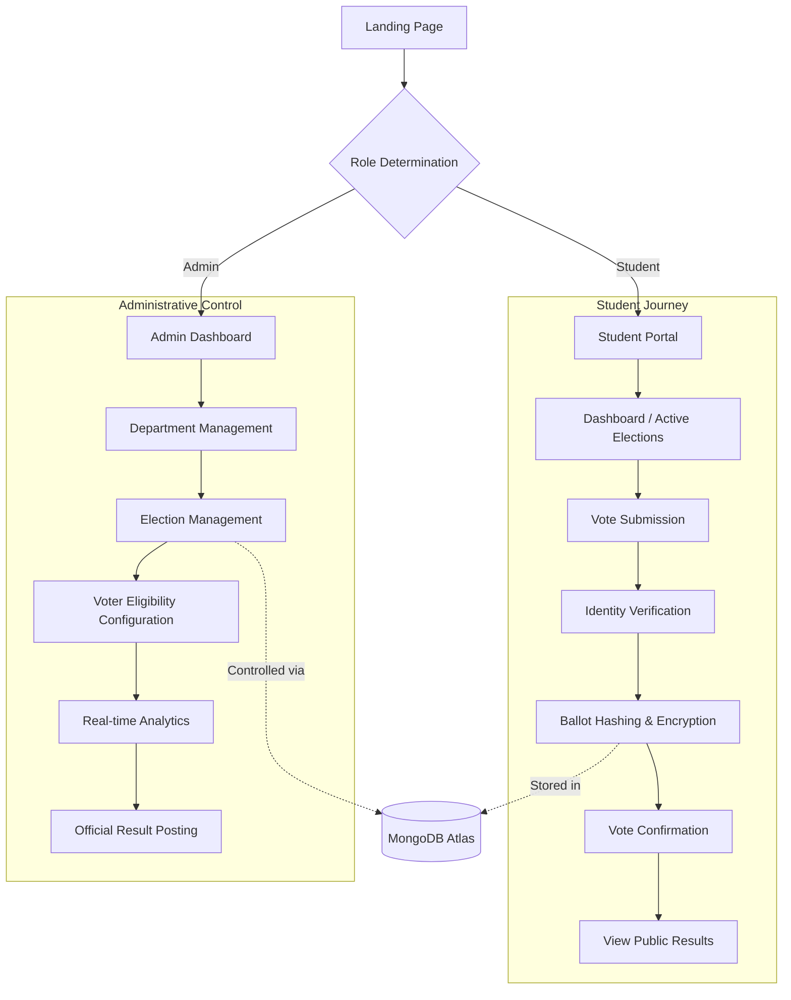

# 🗳️ VoteHub

**VoteHub** is a high-performance, secure, and modern digital democracy platform designed specifically for university election infrastructure. It provides a seamless, transparent, and immutable voting experience for students while offering comprehensive governance tools for administrators.

---

## 🚀 Vision
To digitize and secure university governance through state-of-the-art cryptographic standards, real-time analytics, and a premium user experience.

---

## 🏗️ Project Architecture & Workflow

### Workflow Flowchart


---

## ✨ Features

### 🎓 Student Portal
- **Advanced Ballot UI**: Modern, intuitive interface for selecting candidates.
- **Secure Voting**: End-to-end identity verification and session-based security.
- **Independent Theming**: User-specific light/dark mode persistence.
- **Transparency**: Live upcoming election notices and post-election result visualization.

### 🛡️ Administrative Terminal
- **Election Lifecycle**: Complete control from scheduling to result publication.
- **Granular Eligibility**: Filter voters by department, year, and specific academic criteria.
- **Real-time Analytics**: Visualized voting trends and participation rates.
- **Audit Trails**: Immutable logs of all administrative actions.

---

## 🛠️ Tech Stack

### Frontend
- **Framework**: React 18 (Vite)
- **Styling**: TailwindCSS & Shadcn UI
- **Animations**: Framer Motion
- **Icons**: Lucide React
- **Theming**: Next Themes (Customized for Portal Isolation)

### Backend
- **Runtime**: Node.js
- **Server**: Express.js
- **Database**: MongoDB (via Mongoose)
- **Security**: Environment variable-based configuration (`dotenv`)

---

## 📦 Installation & Setup

### Prerequisites
- Node.js (v18+)
- MongoDB Atlas Account

### Steps

1. **Clone the Repository**
   ```bash
   git clone https://github.com/Barathfiless/VoteHub.git
   cd VoteHub
   ```

2. **Backend Setup**
   ```bash
   cd server
   npm install
   # Create a .env file with:
   # PORT=5000
   # MONGO_URI=your_mongodb_connection_string
   npm run dev
   ```

3. **Frontend Setup**
   ```bash
   cd ../client
   npm install
   # Create a .env file with:
   # VITE_API_URL=http://localhost:5000
   npm run dev
   ```

---

## 🔒 Security Practices
- **Environment Protection**: All database credentials and API endpoints are managed via `.env` and shielded by `.gitignore`.
- **Portal Isolation**: Independent theme and state management for Student and Admin portals.
- **Data Integrity**: Cryptographic hashing metaphors in the UI represent actual backend integrity checks.

---

## 🗺️ Roadmap
- [ ] Integration of Face-API.js for biometric verification.
- [ ] Multi-region node deployment for high availability.
- [ ] Automated SMS/Email voting notifications.

---

## 📄 License
Proprietary Governance Infrastructure - © 2026 VoteHub Systems.
